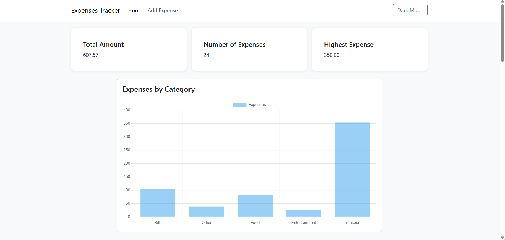
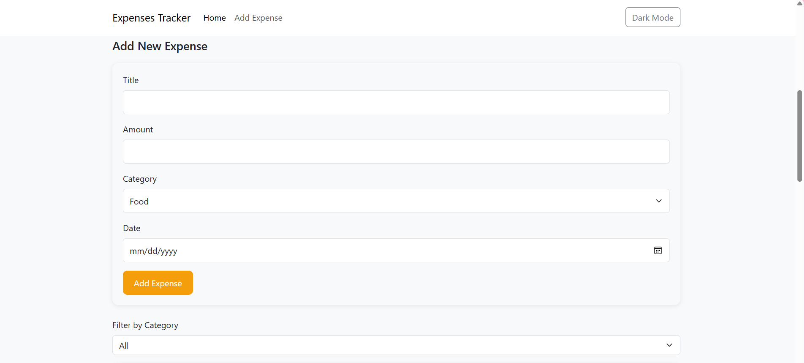
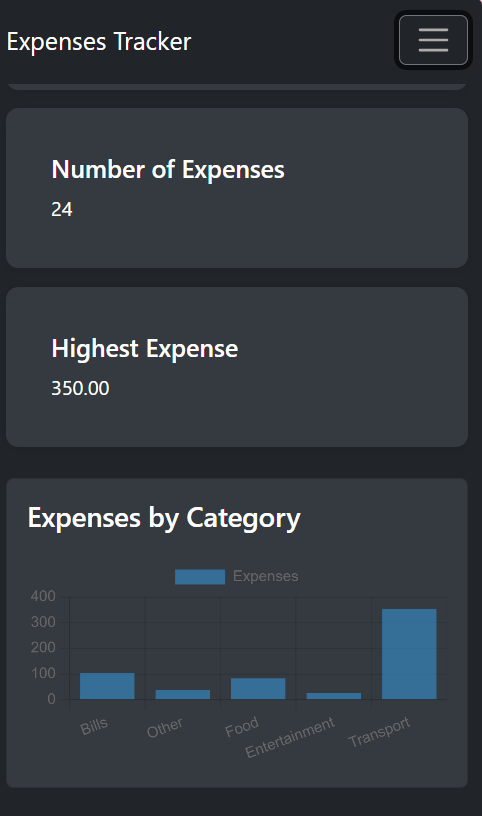
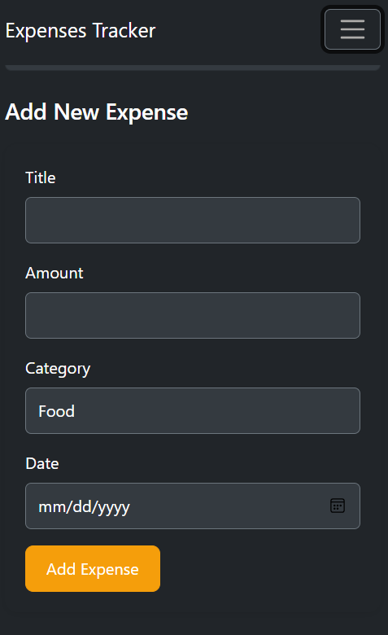

# Expenses Tracker

# Description
Expenses Tracker is a web application for tracking personal daily expenses.

Users can add expenses by entering the title, amount, category, and date.
The expenses are display in a table where users can edit or remove expenses.
Users can also filter expenses by category to display specifice expense information.
The application also provids summary information about the expenses, such as the total amount, number of expenses, and highest expense.
Users can switch between Dark Mode and Light Mode .

## Technologies Used
 - Frontend:
  - HTML
  - CSS
  - JavaScript
  - Bootstrap
- Backend:
 - Node.js
 - Express.js
 - Rest API
- Database:
 - PostgreSQL
- Development Tools:
 - Nodemon

## Project Structure
```text

Expenses Tracker/
├── backend/
│   ├── server.js
│   ├── schema.sql
│   ├── package.json
│   └── package-lock.json
├── frontend/
│   ├── css/
│   │   └── style.css
│   ├── js/
│   │   └── app.js
│   └── index.html
├── screenshots/
├── README.md
└── .gitignore

## Requirements

- Node.js
- PostgreSQL
- npm

## Installation

## 1. Clone the repository
 - git clone https://github.com/shaima-bataineh/Expenses-Tracker.git
```md
 2. Set up the database
  open pgAdmin/PostgreSQL
  Create the database
  Run the `schema.sql` file

 3. Set up environment variables
 - create file name .env 
 - Add the following variables:

   DB_HOST= localhost
   DB_PORT= 5432
   DB_USER= postgres
   DB_PASSWORD= your_password

DB_NAME=your_database_name

### 4. Install dependencies
```bash
cd backend
npm install

### 5. Run the backend


npm run dev

 6. Run the frontend

Open `frontend/index.html` using Live Server.

 Features
- Responsive design for mobile and desktop
- summary cards
- Chart showing expenses by category
- dark mode and light mode
- Form to add a new expense
- Filter expenses by category
- Display expenses in a table
- Edit and remove expenses
- Edit expenses using a modal
- Remove expenses from the table

## Screenshots





### Mobile






## Challenges & Solutions

 Challenge 1: 
  table was not displaying correctly on mobile screens.

 Solution

I used a responsive table container with horizontal scrolling and tested the layout using browser DevTools.

 Challenge 2: Chart.js

The chart was not working because of an error when using Object.keys and Object.values.

 Solution

I fixed the JavaScript error and updated the chart correctly using Chart.js.

 Challenge 3: Dark Mode

Some elements were not clear when switching to Dark Mode.

Solution

I added specific CSS styles for the Dark Mode to make the text, buttons, table, and other elements clear.

Challenge 4: Bootstrap
I had some difficulty using Bootstrap classes and components.

 Solution
I learned how to use Bootstrap classes for the navbar, forms, modal, and responsive design.

Challenge 5: Cache
The API returned a 304 status, and the frontend treated it as an error.

Solution
I used cache: "no-store" in the fetch request to get the current data from the API.
